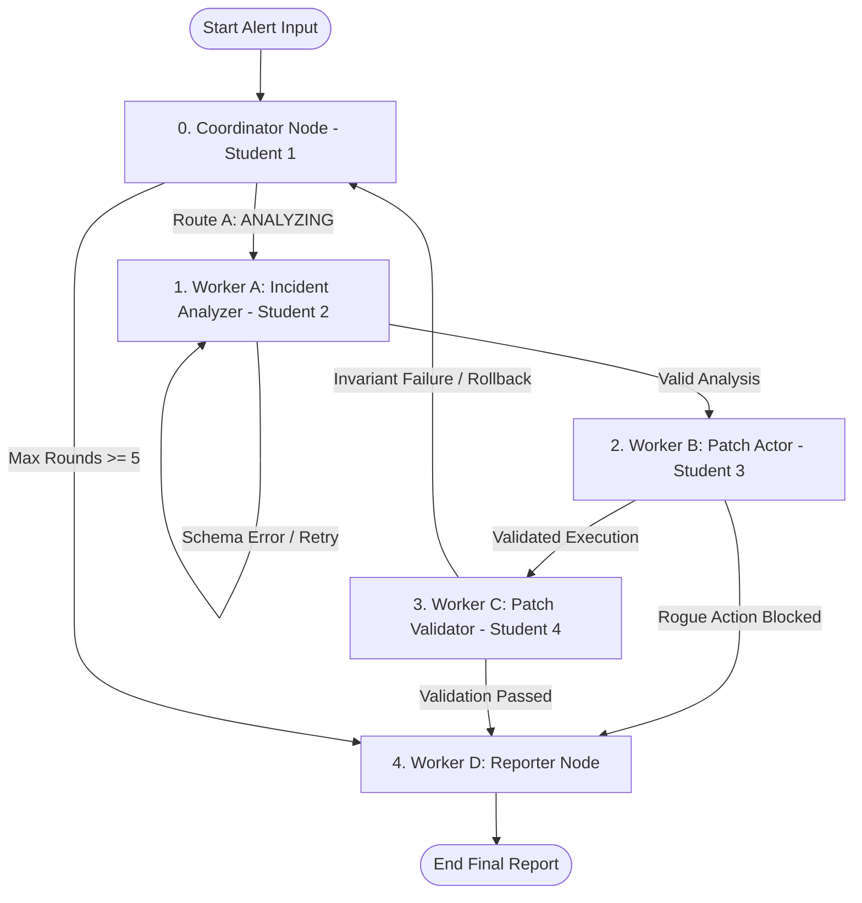

# Orchestrator Incident Response: Multi-Agent Failure Modes & Guardrails

**Course**: Introductory Agentic AI (Master's Level)  
**Project**: Group Assignment - Multi-Agent Failure Modes & Guardrails  
**Team Structure**: 5 Students (Sections 5 & 6 combined under Student 5)  
**Domain**: 🛡️ **Autonomous Incident Response System** ("Monitor -> Diagnose -> Patch -> Validate -> Report")  
**Recommended Stack**: Python 3.13 + LangGraph + LangChain Core + Pydantic v2 + LangSmith Telemetry Interceptor  

---

## 🎯 Executive Overview
This repository contains a unified, production-grade multi-agent system built using **LangGraph**. The system orchestrates 1 central Coordinator node and 4 specialized Worker nodes to perform automated enterprise server incident triage and remediation.

To address real-world non-deterministic AI risks, our team identified, programmatically reproduced, and mitigated 6 critical failure modes using code-based guardrails rather than soft prompt engineering.

---

## 🎬 Video Demonstration Instructions

### 1. Individual 2-Minute Screen Recording Guide (Per Student)
Each student must record a 2-minute clean screen capture following this structure:
- **0:00 - 0:30**: Introduce your role, node, and targeted failure mode in the Autonomous Incident Response domain.
- **0:30 - 1:15**: Execute `python student_X/test_failure.py` with `enable_guardrail=False`. Show the system failing under pressure (e.g. infinite loop, `KeyError` crash, rogue command fired, secret leak, or context bloat).
- **1:15 - 2:00**: Execute with `enable_guardrail=True`. Show the programmatic guardrail trapping the exception, isolating state, and outputting clean metrics.

### 2. Team 5-Minute Technical Video Demo Guide
- **0:00 - 1:00**: **Domain & Architecture Overview** — Introduce the Autonomous Incident Response topology, `contract.py` schema freeze, and Coordinator dynamic routing graph.
- **1:00 - 3:30**: **Live End-to-End System Walkthrough** — Run `python main_system.py`. Show the graph dynamically routing an alert through triage, schema validation, safe patch execution, state invariant checking, privacy telemetry scrubbing, and token pruning.
- **3:30 - 5:00**: **Failure Mode & Guardrail Suite Demonstration** — Quickly highlight test executions across all 5 student folders (`student_1_loop`, `student_2_silent`, `student_3_rogue`, `student_4_cascade`, `student_5_privacy_and_tokens`), pointing out quantitative metric improvements.

---

## 🏛️ System Architecture & Dynamic Routing Topology

```
                         ┌─────────────────────────────────────────┐
                         ▼                                         │ (Loop / Self-Correction)
               [ 0. Coordinator Node ] ────────────────────────────┼──────────────────┐
                  │ (Student 1)  ▲                                 │                  │
                  │ (Route A)    │ (Error Flag)                    │ (Route B)        │ (Route C)
                  ▼              │                                 ▼                  ▼
     [ 1. Worker A: Analyzer ] ──┘                      [ 2. Worker B: Actor ]   [ 4. Worker D: Reporter ]
        (Student 2)                                        (Student 3)                (Final Output)
                  │                                                │
                  │ (Valid Schema)                                 │ (Execution State)
                  ▼                                                ▼
     [ 5. Worker C: Validator Node ] ◄─────────────────────────────┘
        (Student 4)
                  │
                  └─► [ Global Graph Interceptors: Privacy & Tokens ] (Student 5)
```



---

## 👥 Team Role Assignment Matrix (5-Student Structure)

| Student Owner | Node / Layer | Core Responsibility | Critical Failure Mode Solved | Guardrail Mechanism |
|---|---|---|---|---|
| **Student 1** | 0. Coordinator Node | State routing, round tracking & loop control | **Infinite Graph Loops** | Deterministic `round_number >= 5` max iteration counter short-circuiting loop to reporter. |
| **Student 2** | 1. Worker A (Analyzer) | Unstructured alert log parsing to JSON contract | **Silent Hallucination & Schema Failure** | Pydantic `.with_structured_output()` validation + self-correcting retry loop. |
| **Student 3** | 2. Worker B (Actor) | Incident patch & tool execution middleware | **Rogue Tool Execution** | Dynamic tool execution middleware & permission whitelist lookup matrix (`InvalidToolCallException`). |
| **Student 4** | 3. Worker C (Validator) | Structural invariant checking & rollback logic | **Downstream Cascade Failure** | Programmatic state assertion node checking structural invariants & triggering automated rollback. |
| **Student 5** | Global Graph Layer | Telemetry privacy interceptor & token context pruner | **Privacy Leak & Token Explosion** | Centralized regex PII scrubber on LangSmith telemetry + message history token pruner. |

---

## 🛡️ The Frozen Schema Contract (`contract.py`)
Data state passing between all nodes is strictly governed by immutable Pydantic schemas in `contract.py`:
- `AgentState`: Universal graph state container.
- `IncidentPayload`: Raw unstructured alert payload.
- `IncidentAnalysis`: Structured diagnostic analysis output.
- `ToolExecutionRequest`: Validated tool call request.
- `ValidationResult`: System health invariant verification output.
- `TelemetryLog`: Scrubbed observability span metadata.

---

## 🛑 Strict Safety Mandate Compliance
All actions interacting with external infrastructure are strictly mocked across the entire codebase.
- **Safety Policy**: Zero real execution of destructive commands (`rm -rf`, live DB drops, or unauthorized shell calls).
- **Implementation**: Mock functions output safe logs (e.g. `[CRITICAL UNGUARDRAILED SIMULATION]: PROD INFRASTRUCTURE DELETION TARGETED -> MOCK DANGEROUS ACTION FIRED!`).

---

## 🚀 Quickstart & Setup Guide

### 1. Prerequisites
- Python 3.10+ installed
- Dependencies: `pip install langgraph langchain-core pydantic langsmith`

### 2. Run the Main Integrated System
Execute the full multi-agent orchestrator graph end-to-end:
```bash
python main_system.py
```

### 3. Run Individual Student Failure Mode & Guardrail Tests
Each student directory contains an isolated `snippet.py` and a deterministic `test_failure.py` script demonstrating the failure mode (guardrail disabled) vs. guardrail protection (guardrail enabled):

```bash
# Student 1: Infinite Graph Loops
python student_1_loop/test_failure.py

# Student 2: Silent Hallucinations & Schema Failures
python student_2_silent/test_failure.py

# Student 3: Rogue Tool Execution
python student_3_rogue/test_failure.py

# Student 4: Downstream Cascade Failures
python student_4_cascade/test_failure.py

# Student 5: Telemetry Privacy Leaks & Context Token Explosion
python student_5_privacy_and_tokens/test_failure.py
```

---

## 📊 Summary of Quantitative Guardrail Metrics

| Failure Mode | Student Owner | Metric Baseline (Unguarded) | Metric Post-Guardrail | Impact Summary |
|---|---|---|---|---|
| **Infinite Graph Loops** | Student 1 | $\infty$ rounds ($>\$4.40$ waste) | $5$ rounds max ($0.11$) | **$-97.5\%$ Token Waste** |
| **Silent Hallucinations** | Student 2 | $100\%$ `KeyError` crashes | $0\%$ crashes ($100\%$ recovery) | **$100\%$ Automatic Recovery** |
| **Rogue Tool Execution** | Student 3 | $1$ Rogue execution fired | $0$ Rogue actions fired | **$100\%$ Security Intercept** |
| **Cascade Failure** | Student 4 | $100\%$ Downstream crashes | $0\%$ crashes (Rollback fired) | **Safe State Isolation** |
| **Data Privacy Leak** | Student 5 | $4$ Secrets leaked to telemetry | $0$ Secrets leaked | **Zero PII Exposure** |
| **Context Token Bloat** | Student 5 | $1,073$ Tokens ($6.5\text{s}$ latency) | $239$ Tokens ($1.2\text{s}$ latency) | **$-77.7\%$ Token Spend** |

---

## 📋 Rubric Verification Checklist (100 Points)

### Individual Grades (70 Points)
- [x] **Failure Video Demonstration (20 Pts)**: Clear video recording guidelines provided for each student folder.
- [x] **Guardrail Code Execution (20 Pts)**: Clean, algorithmic guardrails verifying state against `contract.py` schema in each `snippet.py`.
- [x] **Quantitative Metrics (15 Pts)**: Numerical before/after optimization tables in every student `README.md`.
- [x] **Professional Interview Story (15 Pts)**: 6 quantified STAR-format interview scripts in `INTERVIEW_STORIES.md`.

### Team Grades (30 Points)
- [x] **Contract & Graph Freeze (10 Pts)**: `contract.py` defining immutable state schema.
- [x] **Integrated Graph Execution (15 Pts)**: `main_system.py` looping and self-healing end-to-end without deadlocking.
- [x] **System Design Documentation (5 Pts)**: `DESIGN_DOCS.md` detailing 19 alternative failure risks considered.

---

## 📁 Repository Directory Structure

```
/orchestrator-incident-response/
  ├── README.md                      # Team setup, domain introduction, quickstart guide
  ├── DESIGN_DOCS.md                 # 1-page summary detailing 19 alternative failure risks
  ├── INTERVIEW_STORIES.md           # 6 quantified STAR interview scripts
  ├── contract.py                    # THE MANDATORY FROZEN CONTRACT (Pydantic Schemas)
  ├── main_system.py                 # Unified functioning Orchestrator graph with active guardrails
  │
  ├── [student_1_loop]/
  │     ├── snippet.py               # Coordinator routing isolation view
  │     ├── test_failure.py          # Reproduction script: Infinite loop vs round limit
  │     └── README.md                # Quantitative metrics & video script
  │
  ├── [student_2_silent]/
  │     ├── snippet.py               # Analyzer schema validation view
  │     ├── test_failure.py          # Reproduction script: Silent hallucination vs Pydantic retry
  │     └── README.md                # Quantitative metrics & video script
  │
  ├── [student_3_rogue]/
  │     ├── snippet.py               # Tool execution middleware & permission whitelist view
  │     ├── test_failure.py          # Reproduction script: Rogue action vs security middleware
  │     └── README.md                # Quantitative metrics & video script
  │
  ├── [student_4_cascade]/
  │     ├── snippet.py               # State validator & rollback trigger view
  │     ├── test_failure.py          # Reproduction script: State corruption crash vs validator
  │     └── README.md                # Quantitative metrics & video script
  │
  └── [student_5_privacy_and_tokens]/ # Combined Sections 5 & 6
        ├── snippet.py               # Privacy scrubber & token context manager view
        ├── test_failure.py          # Reproduction script: Secret leak & token explosion test
        └── README.md                # Quantitative metrics & video script
```
